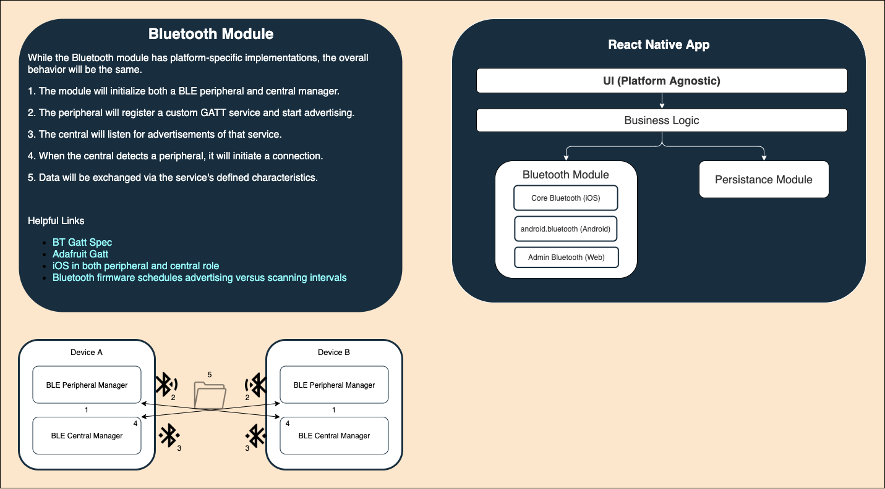

# Grapevine

A mobile application that enables anonymous gossip messaging peer-to-peer with devices you physically pass. Messages are ranked by the number of devices they have reached (ie. the virality). This digital approach to gossiping will bring new meaning to “I heard it through the grapevine."

## Technology Overview

### API

API specific docs [here](/api).

Our platform-neutral data structure for exchanges from device to device and server to device is [Protobuf](https://developers.google.com/protocol-buffers).

### App

App specific docs [here](/app).

The foundation of the mobile application is react native. Custom platform specific modules are used to perform bluetooth low energy networking.

### CLI

Command-line specific docs [here](/cli).

Tool for interacting with Grapevine devices and related services.

### Web

Simple web interface for interacting with Grapevine devices.
